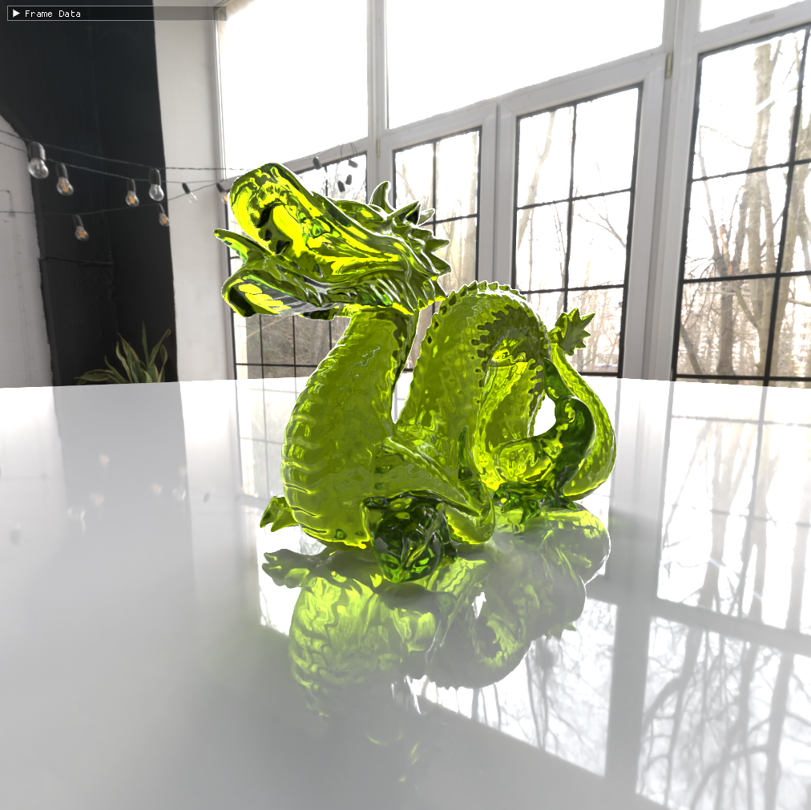
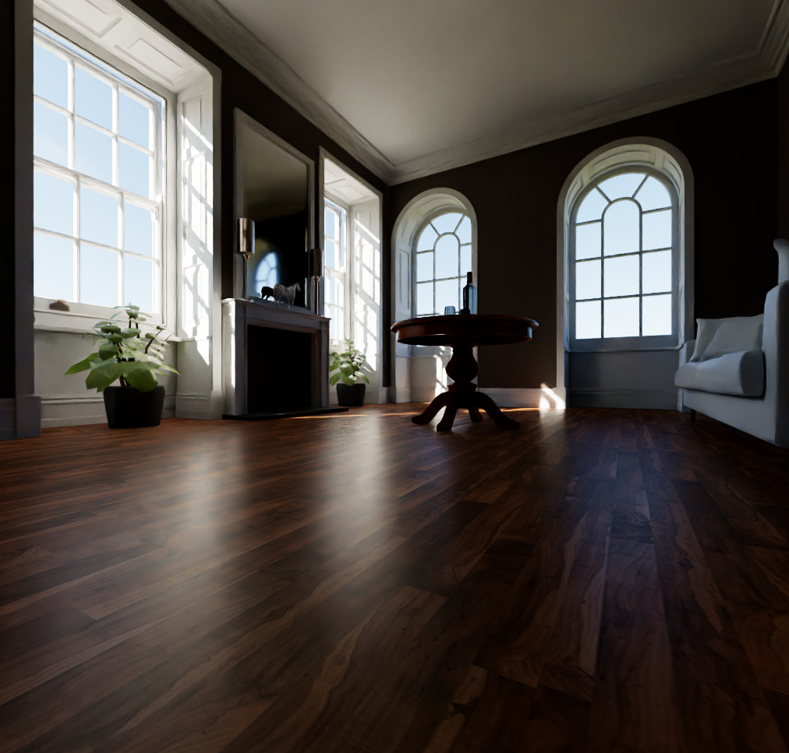
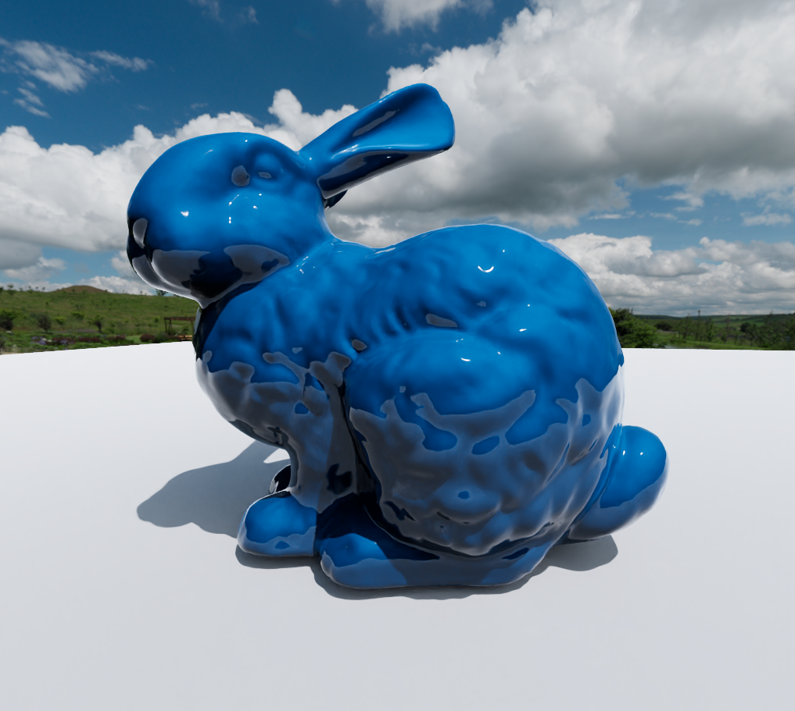

# PathTracer

A GLSL PathTracer based on Compute Shaders with the goal to perform light transport simulation, to achieve realistic rendered images.\
I don't have intention to further implement features for this project, but I hope that this may be useful to anyone.\
This project has been tested on a RTX 3060 Laptop, and has been programmed according to Nvidia's OpenGL requirements.\
This project was made for my Bachelor Thesis at ITU Copenhagen for Software Development.

## Controls

Space to enable movement

WASD to move around

Shift to speed up

Mouse to look around

## Rendering framework based on

https://github.com/gabrieldelacruz/graphics-programming-2023

## Sources

https://github.com/AKGWSB/EzRT

https://github.com/SebLague/Ray-Tracing

https://github.com/boksajak/brdf

https://github.com/boksajak/referencePT

https://github.com/knightcrawler25/GLSL-PathTracer

https://github.com/mmp/pbrt-v4

https://jacco.ompf2.com/2022/04/13/how-to-build-a-bvh-part-1-basics/

## Images

